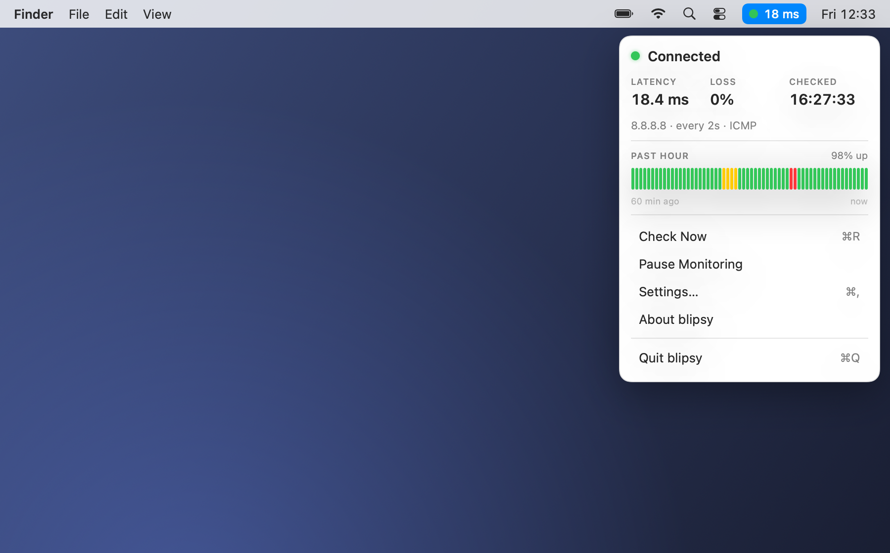
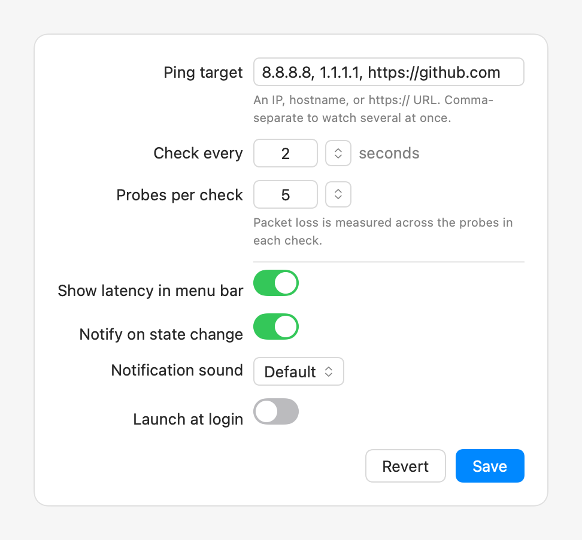
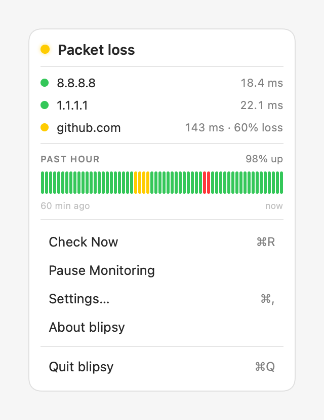

<div align="center">


# blipsy.

**A quiet menu bar dot that tells you the truth about your connection.**
Green means good, yellow means flaky, red means down. Nothing to open, nothing to read.

macOS 13+ · [Report an issue](https://github.com/moharnadreza/blipsy/issues)

</div>

---

## The whole app, at a glance

The icon *is* the entire interface: a colored dot in your menu bar. Click it for
latency, packet loss, a past-hour timeline, and quick actions.

<div align="center"></div>

## Three states, one rule each

The icon only ever says one of three things.

|      | State           | What it means                                            | Rule                |
| :--: | :-------------- | :------------------------------------------------------- | :------------------ |
| 🟢   | **Connected**   | Probes are coming back. You're online and healthy.       | packet loss ≤ 40%   |
| 🟡   | **Packet loss** | Some probes are dropping. The line is up but unreliable. | packet loss > 40%   |
| 🔴   | **Down**        | Nothing is coming back. The target is unreachable.       | packet loss = 100%  |

## Settings, the only screen there is

Opens with `⌘,`, a standard macOS Settings window. Monitoring changes apply on **Save**
(so blipsy never probes a half-typed target); display toggles apply instantly.

<div align="center"></div>

- **Ping target**: an IP or hostname (ICMP), or a full `https://` URL (HTTP HEAD). Comma-separate to watch several. Default `8.8.8.8`.
- **Check every**: how often to probe (default 2s).
- **Probes per check**: used to compute packet-loss % (default 5).
- **Show latency in menu bar** · **Notify on state change** · **Launch at login**.
- **Notification sound**: choose a system sound or **None** for silent alerts.

## Watching several things at once

Same one field, just comma-separate. One target or five, it's the exact same UI. The
icon reflects the **worst** target; click for the per-target breakdown and the past-hour
uptime.

<div align="center"></div>

## User flow

| Step |            | What happens                                              |
| :--: | :--------- | :-------------------------------------------------------- |
| 1    | **Launch** | Icon appears in the menu bar. No dock icon, no window.    |
| 2    | **Probe**  | Pings `8.8.8.8` every 2s in the background.               |
| 3    | **Color**  | Icon turns green / yellow / red from the result.          |
| 4    | **Glance** | Click for latency, loss, past-hour uptime, quick actions. |
| 5    | **Tune**   | Change target or frequency in Settings, `⌘,`              |

## Install

### Homebrew

```sh
brew install --cask moharnadreza/tap/blipsy
```

blipsy is unsigned, so on first launch right-click it in Applications and choose
**Open** (once). To skip that prompt entirely, add `--no-quarantine` to the command above.

### Direct download

1. Open the [**Releases**](https://github.com/moharnadreza/blipsy/releases) page and download the latest **blipsy.dmg**.
2. Double-click the downloaded file. A small window opens.
3. Drag the **blipsy** icon onto the **Applications** folder in that window.
4. Open **blipsy** from your Applications folder.
5. The first time, macOS may say it's from an unidentified developer (blipsy is free and unsigned):
   - Control-click (or right-click) **blipsy**, choose **Open**, then **Open** again, **or**
   - if it's still blocked, open **System Settings → Privacy & Security**, scroll down, and click **Open Anyway** next to blipsy.
6. A colored dot appears in your menu bar (top-right). Click it any time to see details.
7. When macOS asks, **allow notifications** so blipsy can tell you the moment your connection drops.

To have blipsy start automatically, click the dot → **Settings…** → turn on **Launch at login**.

## Build from source

Requires the Swift toolchain. Command Line Tools are enough, **no Xcode needed**.

```sh
git clone https://github.com/moharnadreza/blipsy.git
cd blipsy
./scripts/make-app.sh          # builds build/blipsy.app
open build/blipsy.app            # first launch: right-click, then Open
./scripts/make-dmg.sh          # packages build/blipsy.dmg for a release
```

## Development

```sh
swift run blipsy --test                       # regression suite (44 checks)
swift run blipsy --selftest 8.8.8.8,1.1.1.1   # probe targets from the CLI
swift run blipsy --screenshots docs           # regenerate the screenshots
./scripts/generate-icon.swift               # regenerate the app icon
```

## Reporting issues

Found a bug or have an idea? **[Open an issue](https://github.com/moharnadreza/blipsy/issues).**

## Acknowledgements

Inspired by [gnome-online-indicator](https://github.com/maryayi/gnome-online-indicator) by [@maryayi](https://github.com/maryayi), which sparked the idea for blipsy.
